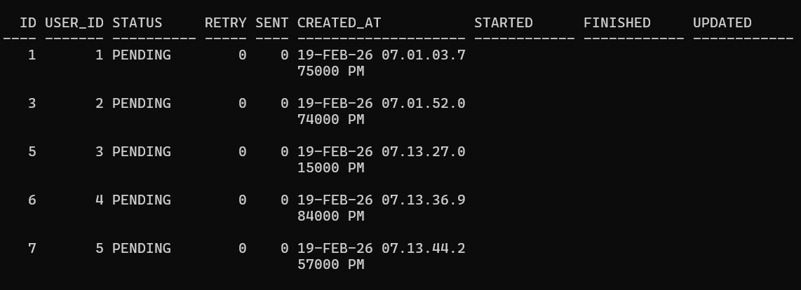
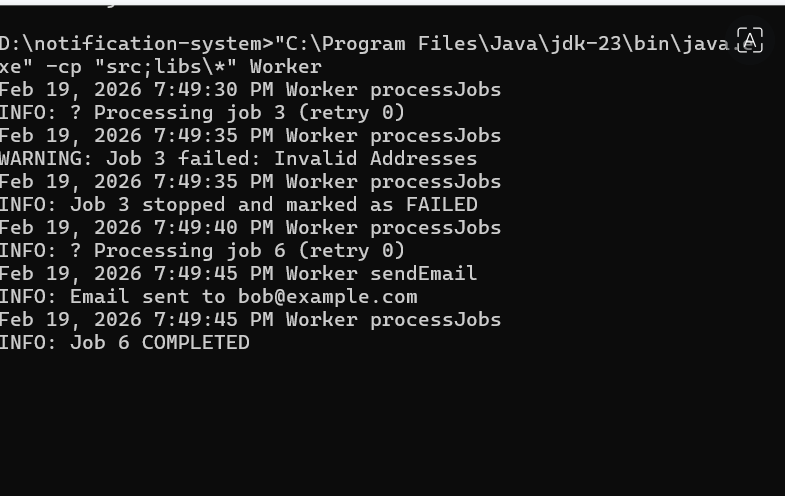
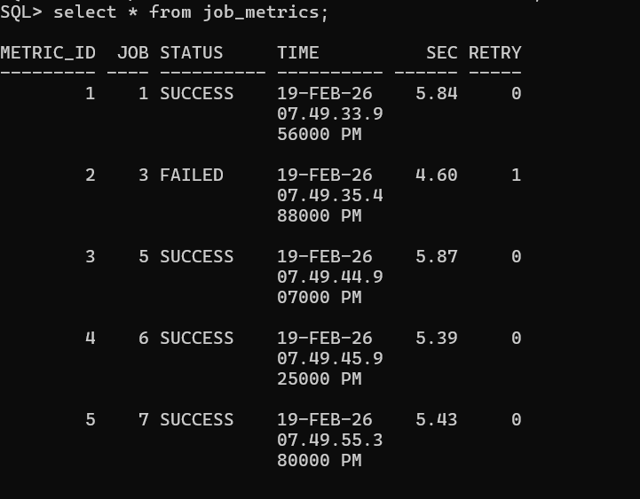
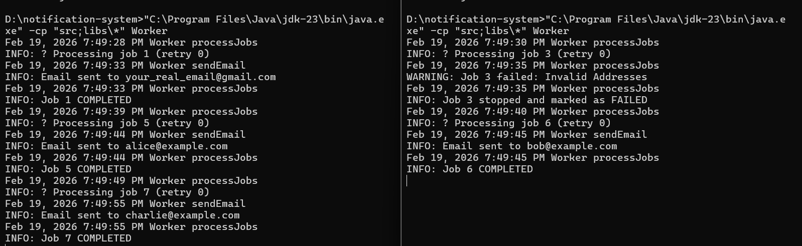

# Fault-Tolerant Email Processing Engine

A production-style Java background worker that processes email jobs from a database queue with **crash safety, retries, concurrency control, and observability**.

This project demonstrates how real backend systems handle failures without losing or duplicating work.


Key Engineering Features

### Concurrency Control
- Uses **Oracle `FOR UPDATE SKIP LOCKED`**
- Multiple workers can run simultaneously without picking the same job

###  Crash Recovery (Visibility Timeout)
- If a worker crashes after claiming a job, the job becomes eligible again after 30 seconds
- Prevents jobs from getting stuck in `PROCESSING` forever

###  Idempotency Protection
- Email is sent **only once**
- Uses `email_sent` flag to prevent duplicate emails even after crashes

###  Retry & Failure Handling
- Jobs retry automatically up to a configurable limit
- After max retries, jobs are marked as `FAILED`
  
## Atomic Job Creation
* User registration and job creation wrapped in single transaction
* If job creation fails, user insert is rolled back
* Ensures a user without a job can never exist in the system
  
###  Observability & Metrics
- Each job execution logs:
  - Processing time
  - Retry attempt
  - Final status (`SUCCESS`, `RETRY`, `FAILED`)
- Stored in a dedicated `job_metrics` table


##  Project Structure
src/ → Java worker code
db/ → Database schema & demo data
docs/ → Proof screenshots


## System Proof (Screenshots)

### 1️ Jobs before processing
Shows all jobs in `PENDING` state  


### 2️ Worker processing with retry & crash simulation


### 3 Job metrics (latency, retries, final state)


### 4 Multiple workers running safely



##  How to Run
1. **Database Setup**: Execute `@db/tables.sql` and `@db/demo_data.sql` in your Oracle SQL environment.
2. **Configuration**: 
   - Rename `config.properties.example` to `config.properties`.
   - Update with your `email.username` and `email.password`.
3. **Execution**:
   ```bash
   cd src
   javac -cp "../libs/*;." Worker.java 
   java -cp "../libs/*;." Worker
